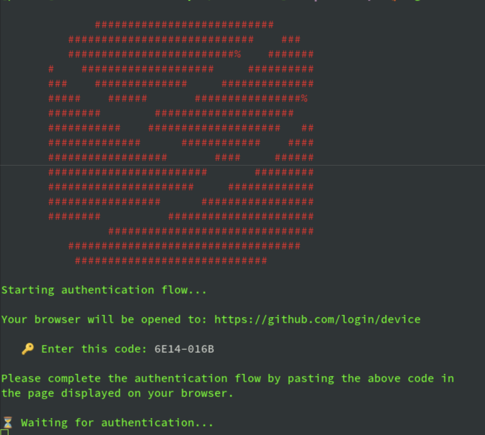
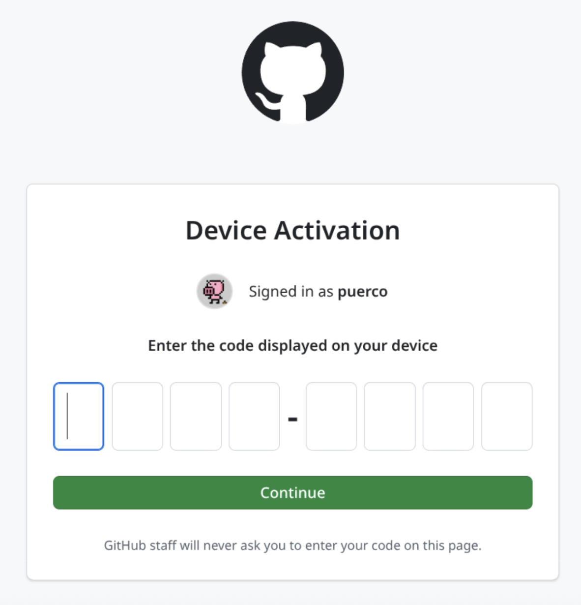
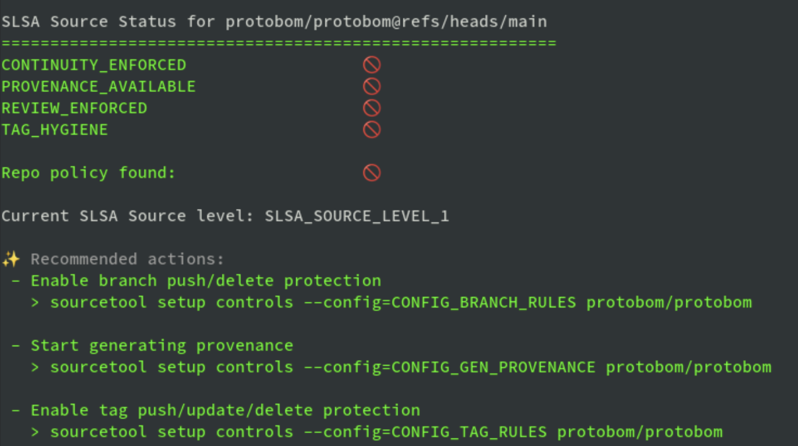
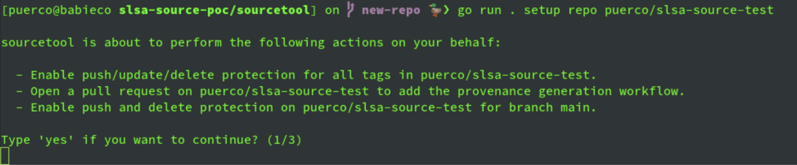
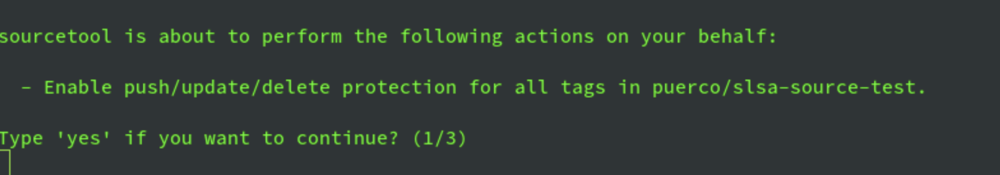
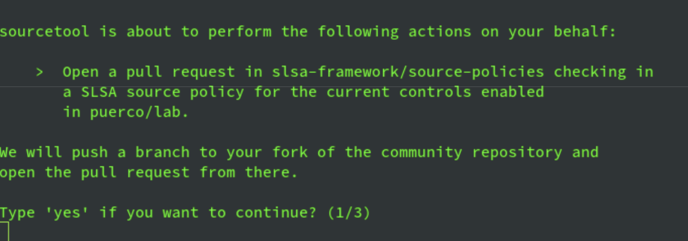
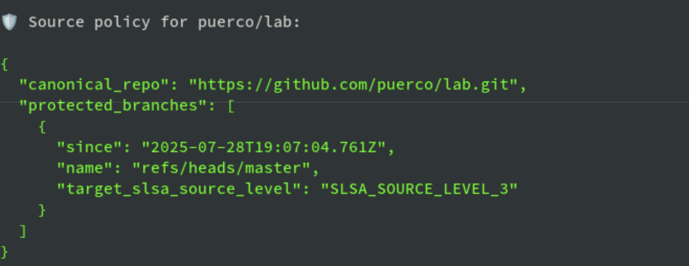
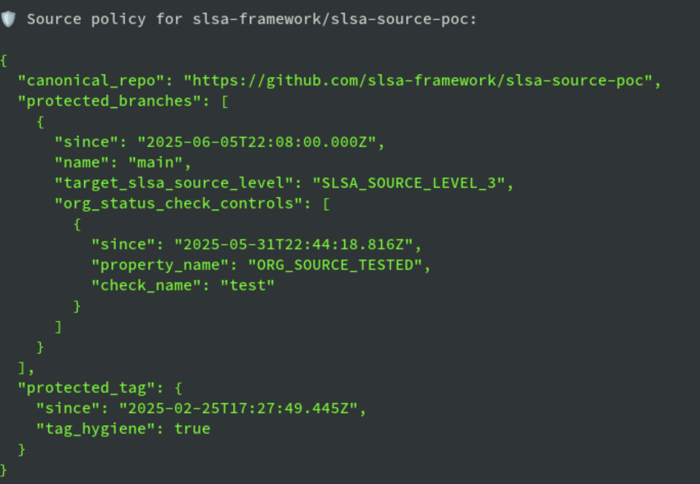
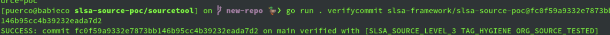

# SLSA Source Tool: Getting Started

This guide provides a detailed outline to harden a repository and start producing
signed evidence to prove its security controls are in place, protecting code
revisions as they land in the codebase.

## TL;DR

If you want to skip [the big read](#onboarding-guide), these instructions should
work for most repositories. If you run into any problems, read on or open an
issue on [github.com/slsa-framework/source-tool](http://github.com/slsa-framework/source-tool).

### Shortest Onboarding (GitHub)

The following examples use `http://github.com/yourorg/yourepo` as a
repository, please substitute it for your repository. You can use the full repo
URL or short identifiers as shown in the examples.

#### Prerequisites

1. Download the sourcetool binary from the
[project releases](https://github.com/slsa-framework/source-tool/releases/latest).

#### Enable SLSA Controls

1. **Authorize the sourcetool app**  
Run the following command and follow the instructions:  

```bash
   sourcetool auth login  
```

2. **Enable all the SLSA controls**
Execute setup subcommand with your repository:

```bash
   sourcetool setup repo youorg/yourepo
```

This will open a pull request on the repository you want to
protect, make sure it is merged before continuing.

3. **Create the repository policy**  
This command will create your repository policy and open a pull
request in the community repo:

```bash
   sourcetool policy create yourorg/yourrepo  
```

#### Check Onboarding Status

At any point you can check the progress of the repository onboarding by running:

```bash
sourcetool status
```

Sourcetool will let you know if there are any outstanding steps to follow and
show the current applicable SLSA Source level.

#### Verify Commits

Once the policy merges on the community repo, you should be able to verify
commits using the embedded attestations stored in git notes in your git repository.
To verify the latest commit, run:

```bash
   sourcetool verifycommit yourorg/yourrepo  
```

## Onboarding Guide

This is the detailed guide to onboard repos to protect them with SLSA Source. For
the  short version, check the [TL;DR section](#TL;DR) at the beginning of this
document for 5 minute instructions.

### Introduction

This guide documents the instructions to use sourcetool to enable SLSA Source
Level 3 controls in a repository. Onboarding a repository involves configuring the
required controls, start generating provenance attestations and creating a source
policy in the community repository.

After onboarding, your repository will start producing unforgeable evidence that
prove branches and tags are (and have been) hardened when revisions are pushed to
your branches, meaning that no commit has merged unsupervised.

## Prerequisites

Before onboarding a new repository to the SLSA Source Track, please ensure you have done the following:

#### 1. Make sure you have access to the repository

Make sure you have proper permissions on the repository you want to protect to
configure rules and push feature branches. You need to have admin access or have
a custom role with the "edit repository rules" permission. Provenance generation
will be enabled through a regular pull request.

#### 2. Download sourcetool

Download the `sourcetool` binary for your local architecture from the [GitHub
releases page](https://github.com/slsa-framework/slsa-source-poc/releases/latest).

## Authorize Sourcetool to Access your Repositories

Log in to grant sourcetool access to your repositories. We have an easy,
interactive flow in the CLI. Run the following command and follow the instructions:

```bash
sourcetool auth login  
```

That command will display an eight character code and open your browser to
authorize the sourcetool app:



On the displayed webpage, enter the eight characters as displayed on your terminal:



Follow the instructions, you will be presented with a list of repositories you
want to grant access to. You choose all your repos or just let sourcetool work
on a select few.

### Verify Access

Once done, you can verify that sourcetool is correctly logged in by running the
following:

```
sourcetool auth whoami  
```


All’s set, you can now start securing your repos.

## Checking Onboarding Status

Once you are logged in, you can check the onboarding status of a repository
using the `status` subcommand:

```bash
sourcetool status yourorg/yourrepo  
```

The status subcommand will show the control implementation status, if a policy
was found and the current SLSA level of the repository:



## One-shot Repository Set Up

The quickest way to set up a repository is to use sourcetool’s one-shot set up
mode. This will enable all controls at once. If you want more granular control
enabling each control, see the Step By Step guide below.

### Set up all Controls

To enable all the SLSA recommended protections, run the `setup repo` subcommand:  

```bash
sourcetool setup repo yourorg/yourrepo  
```

Sourcetool will confirm the actions it will perform before modifying anything.
Type `yes` to proceed.



## Step-by-step Control Setup

To have more granular enabling each of the SLSA protections in the repo, use
`sourcetool setup control`. This subcommand lets you enable individual
protections in the repo if the all-at-once approach is too scary.

The `setup control` subcommand takes a configuration label and enables only that
specific control. For example, to enable tag protection on `yourorg/yourrepo`, run:  

```bash
sourcetool setup controls --config=CONFIG_TAG_RULES yourorg/yourrepo
```



Again, sourcetool confirms before modifying anything. Type yes to proceed.

Configuration Labels  
Each configuration label enables a control configuration of those that sourcetool
can manage. The following are the supported labels and their effects:

| Configuration Label | Description |
| :---- | :---- |
| `CONFIG_BRANCH_RULES` | Configures push and delete branch protection in the repository, required to reach SLSA source level 2+. |
| `CONFIG_TAG_RULES` | Configures update, push and delete protection for all tags in the repository, This is required to reach SLSA source level 2+. |
| `CONFIG_GEN_PROVENANCE` | Opens a pull request in the repository to add the provenance generation workflow after every push. |
| `CONFIG_POLICY` | Opens a pull request on the SLSA policy repository to check in a SLSA Source  policy for the repository. |

You can view these with `sourcetool setup controls --help`

Note that the source policy (`CONFIG_POLICY`) is not one of the SLSA controls but
the policy creation is abstracted as another control configuration to simplify
using sourcetool when scripting.

## Creating the Source Policy

The repository policy is guarded at the community repository and informs
verifying tools the time periods when branches have been protected under their
current SLSA level.

sourcetool can automatically create the repository policy by checking the
enabled protections. You can create the policy at any time but it is recommended
to do it once you finish setting up the desired controls in the repo.

To create the policy, use the `sourcetool policy create` subcommand. Sourcetool
will look at the implemented controls and issue the policy according to the
achieved SLSA level:



Typing `yes` will create the policy JSON and open a pull request on the SLSA
source policies community repo (`slsa-framework/source-policies`). If you want
to open the PR manually, you can pass the `--pr=false` flag. Sourcetool will only
print the policy and you can open the pull request manually:



### Viewing a Repository Policy

To retrieve and display a repository policy, use the `sourcetool policy view`
subcommand:

```bash
sourcetool policy view yourorg/yourrepo  
```



## Verifying Commits

Once the SLSA controls are in place, each commit pushed into the repository will
generate source provenance metadata and store it in git notes by default. These
attestations and VSAs can be used to verify the SLSA level of the repository.

To verify a commit, use the `verifycommit` subcommand. Pass it a commit locator
like this:

```bash
sourcetool verifycommit slsa-framework/slsa-source-poc@fc0f59a9332e7873bb146b95cc4b39232eada7d2  
```



If you omit the commit SHA, sourcetool will verify the last commit in the branch.

## Troubleshooting

### Workflow Errors

commit xxx has more than one parent \[...\] which is not supported  
This error happens when your repository uses merge commits. While not officially supported, you can enable the experimental support in sourcetool by enabling the `allow-merge-commits` option in the `.github/workflows/compute_slsa_source.yaml` workflow in your repo:

```yaml
    uses: slsa-framework/source-actions/.github/workflows/compute\_slsa\_source.yml@main  
    with:  
      allow-merge-commits: true  
```

### Sourcetool CLI Error Messages

**Repository is empty**

If you initialize a new repo and it does not have any commits yet, onboarding will fail as there are no commits to look for existing provenance. This error should go away after the first push.

**503 No server is currently available to service your request.**  

This error usually means there is a disruption with GitHub services, usually waiting and retrying should make it go away, optionally check [https://www.githubstatus.com/](https://www.githubstatus.com/) to check for service outages.
